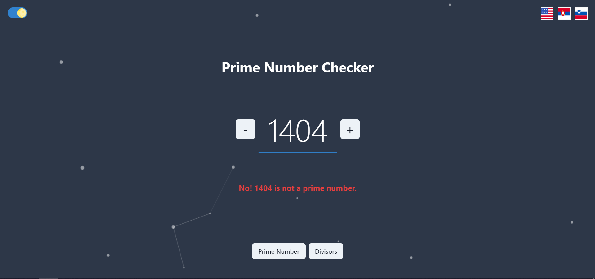

# Numberzen

> Number analysis translated in three different languages with light and dark theme

Simple project built after watching Web Dev Simplified's course. Includes checker for prime numbers and find divisors functionality. Main point was to sharp react skills and use React Router, Context API and LocalStorage.

_Live demo: [numberzen.netlify.app](https://numberzen.netlify.app)_



## Installation

OS X & Linux & Windows:

```sh
npm install
```

## Usage

Main idea was to create a simple boilerplate and present usage of React Router and Context API that can be used in future projects.

## Release History

- 0.0.1
  - Simple functionality, includes just prime number checker and divisors finder

## Contributing

1. Fork it (<https://github.com/jorgadev/numberzen/fork>)
2. Create your feature branch (`git checkout -b feature/fooBar`)
3. Commit your changes (`git commit -am 'Add some fooBar'`)
4. Push to the branch (`git push origin feature/fooBar`)
5. Create a new Pull Request
